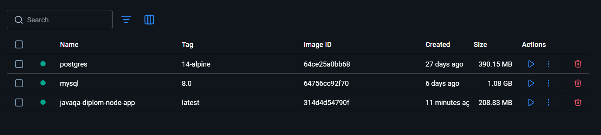
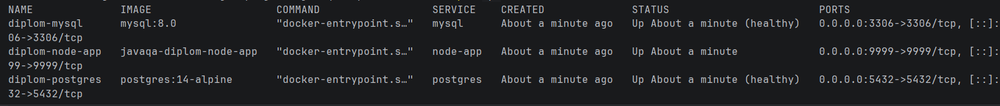
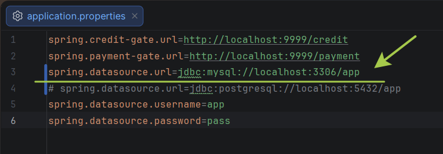
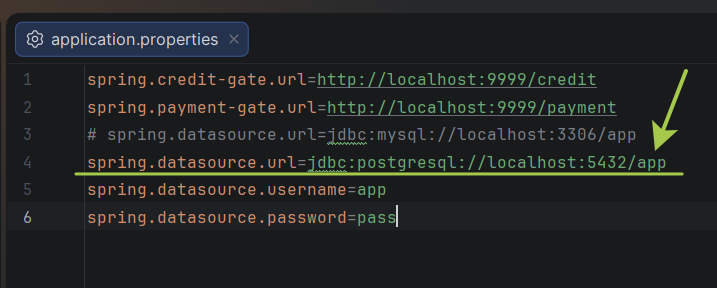
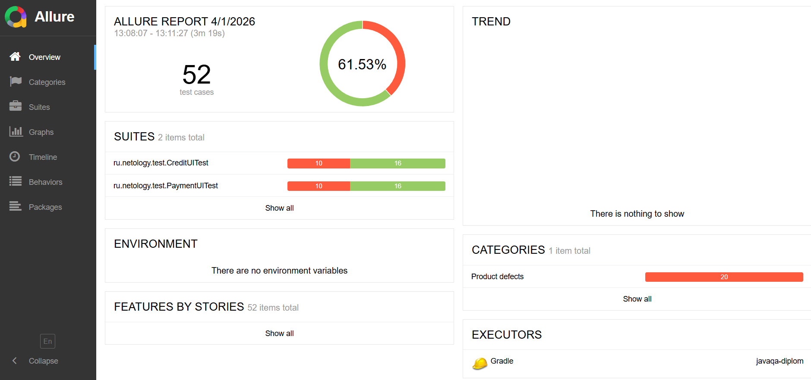
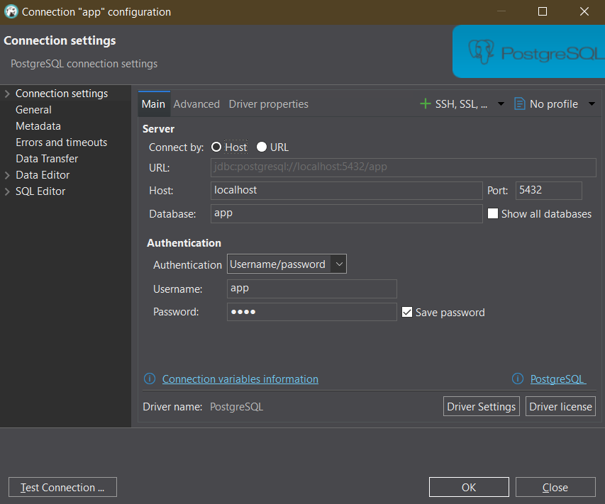
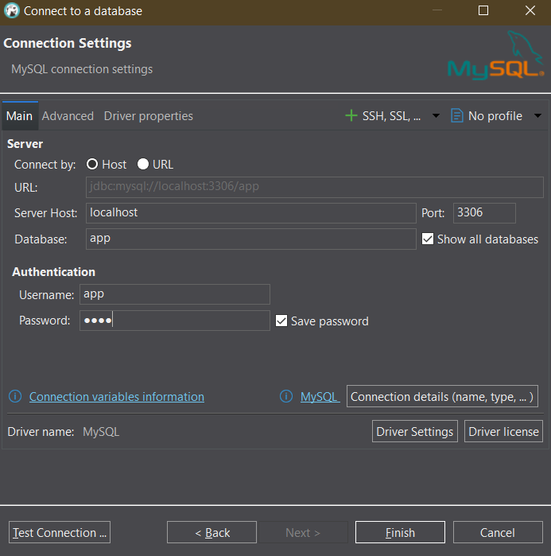

## Автоматизация тестирования сервиса покупки туров

Проект по автоматизации тестирования веб-сервиса покупки туров, где можно совершить покупку как по банковской карте,
так и в кредит по данным карты. Приложение взаимодействует с сервисом платежей и с кредитным сервисом для
работы с данными карт, и сохраняет информацию в базе данных (с поддержкой двух СУБД). Данный проект содержит
план автоматизации тестирования сервиса, инструкцию по подключению и запуску автотестов, реализацию автотестов, а также 
отчетность по проведенному тестированию - репорты в Allure и отчеты о дефектах в GitHub Issues.

### Начало работы

- Перейти по ссылке на репозиторий с проектом:`https://github.com/softpaw-mango-cat/javaqa-diplom/tree/main`
- Скачать проект по кнопке Code - Download ZIP
- Распаковать проект на своём ПК и открыть в Intellij Idea

### Что нужно установить 
- IDE Intellij Idea
- Docker Desktop
- Браузер Google Chrome
- DBeaver для работы с БД

### Запуск сервиса
- Открыть проект в Intellij Idea
- Открыть приложение Docker Desktop
- Открыть терминал в Idea и выполнить команду `docker-compose up`
- Подождать, пока скачаются все нужные образы

**Проверка работы контейнеров**: 

В Docker Desktop отображаются 3 контейнера - `postgres`, `mysql` и `javaqa-diplom-node-app`

В терминале ввести команду `docker-compose ps`, должны также отобразиться 3 контейнера

#### Запуск приложения с поддержкой MySQL
- В файле `application.properties` проверить, что строка с подключением к mysql откомментирована, как на скриншоте

- В терминале ввести команду:
  `java "-Dspring.datasource.url=jdbc:mysql://localhost:3306/app" "-Dspring.datasource.username=app" "-Dspring.datasource.password=pass" -jar app/aqa-shop.jar`
- Проверить, открывается ли приложение в браузере на http://localhost:8080/
#### Запуск приложения с поддержкой Postgre
- В файле `application.properties` проверить, что строка с подключением к postgre откомментирована, как на скриншоте

- В терминале ввести команду:
  `java "-Dspring.datasource.url=jdbc:postgresql://localhost:5432/app" "-Dspring.datasource.username=app" "-Dspring.datasource.password=pass" -jar app/aqa-shop.jar`
- Проверить, открывается ли приложение в браузере на http://localhost:8080/

### Запуск автотестов и просмотр отчётов Allure

- В терминале Idea ввести команду:  
`./gradlew clean test`
- Подождать прогонки всех тестов
- После прохождения тестов, ввести команду:  
`./gradlew allureServe`
- Отчёт откроется в браузере (ниже пример отчета)  

### Подключение к БД и выполнение запросов
- Открыть клиент DBeaver
- Подключиться к СУБД MySQL или Postgre, в зависимости от того, с какой БД запущено приложение

#### Параметры подключения к Postgre
*Хост - localhost, порт - 5432, название БД - app, пользователь - app, пароль - pass*  

#### Параметры подключения к MySQL
*Хост - localhost, порт - 3306, название БД - app, пользователь - app, пароль - pass*

- Выполнить запросы в БД из тест-кейсов ТС01-ТС06, описанных в файле [Plan.md](Plan.md)