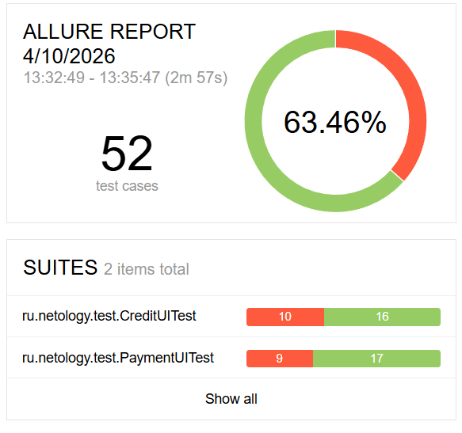

## Отчёт по итогам тестирования

В результате тестирования сервиса по покупке туров была проверена основная функциональность сервиса - это оплата с помощью обычной карты и 
в кредит по данным карты. Обычная оплата и оплата в кредит протестированы отдельно. 

### Тест-кейсы

Количество тест-кейсов: 52  
Процент успешных тест-кейсов: 63,46 %  
33 теста из 52 - Passed ✅   
19 тестов из 52 - Failed ❌  

  

### Баг-репорты 

Количество заведённых баг-репортов: 20  
Баг-репорты оформлены в виде [issues на GitHub](https://github.com/softpaw-mango-cat/javaqa-diplom/issues)  

### Общие рекомендации

**1. Некорректная обработка отклоненных карт**  

При оплате отклоненной картой (статус DECLINED) система показывает успешное уведомление 
об операции и данные об этой операции сохраняются, хотя так быть не должно. 
Это проблема с высоким приоритетом и требует исправления в ближайшее время.  

**Рекомендация**  

Исправить логику обработки ответа от банковского эмулятора. Необходимо корректно распознавать 
статус DECLINED, отображать соответствующее сообщение об ошибке и не проводить такие операции.  

**2. Проблемы с сохранением данных в БД**  

При оплате в кредит данные о кредите сохраняются некорректным образом, перепутаны 
значения payment_id и credit_id в таблице order_entity.  

**Рекомендация**  

Проверить логику сохранения данных при оплате в кредит. При возникновении ошибки 
данные не должны сохраняться в БД. Рекомендуется внедрить откат транзакций при неуспешных операциях.  

**3. Проблемы с валидацией полей формы оплаты/кредита**  

Была обнаружена недостаточная валидация некоторых полей формы (номер карты, год, имя владельца, CVC), при которых
невалидные тестовые данные проходили проверку.  

**Рекомендация**  

Усилить валидацию полей ввода следующим образом:

- Поле "Номер карты" не должно принимать номера, состоящие из нулей
- Поле "Год" должен иметь ограничения по диапазону значений
- Поле "Владелец" должно принимать только латинские буквы и пробелы и иметь ограничения по минимальному и 
максимальному количеству символов
- Поле CVC не должно принимать значения, состоящие из нулей

